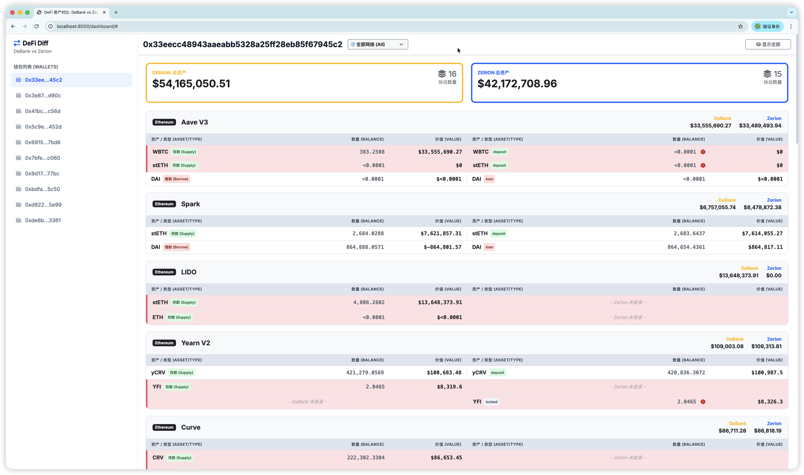

# DeFi Portfolio Comparison Tool



[](https://nodejs.org/)
[](https://docs.open.debank.com/)
[](https://developers.zerion.io/)
[](LICENSE)

A powerful tool to fetch, normalize, and compare DeFi portfolio data from **DeBank** and **Zerion**. It helps developers and analysts cross-verify asset data, identify discrepancies in protocol tracking, and visualize risk exposure across multiple EVM chains.

## 🏗️ Architecture & Workflow

The system operates in a three-stage pipeline, fetching data from multiple providers, normalizing it into a unified format, and presenting it via an interactive dashboard.


## ✨ Features

- **Multi-Source Data Fetching**: Automatically scrapes portfolio data from both DeBank Cloud API and Zerion API.
- **Multi-Chain Support**: Supports Ethereum, BSC, Arbitrum, Optimism, Polygon, Base, Linea, and more.
- **Visual Dashboard**: Includes a modern, dark/light mode web dashboard to visualize and compare assets side-by-side.
- **Diff Highlighting**: Automatically highlights discrepancies in asset balances or missing protocols between the two providers.
- **Risk Detection**: Flags assets marked as "spam" or "trash" by Zerion.
- **Automated Workflow**: Single script execution to fetch, process, and generate comparison reports.

## 🚀 Getting Started

### Prerequisites

- Node.js (v16 or higher)
- Yarn or npm
- API Keys for DeBank and Zerion

### Installation

1. Clone the repository:
   ```bash
   git clone <repository-url>
   cd defi-comparison
   ```

2. Install dependencies:
   ```bash
   yarn install
   # or
   npm install
   ```

3. Configure environment variables:
   Copy `.env.example` to `.env` and fill in your keys.
   ```bash
   cp env.example .env
   ```
   
   **Edit `.env`**:
   ```ini
   DEBANK_ACCESS_KEY=your_debank_key
   ZERION_API_KEY=your_zerion_key
   # Optional: Proxy for API requests (e.g., if you are behind a firewall)
   # HTTPS_PROXY=http://127.0.0.1:7890
   ```

4. Add target addresses:
   Edit `addresses.yaml` to include the wallet addresses you want to analyze.
   ```yaml
   - 0x123...abc
   - 0x456...def
   ```

### Usage

Run the all-in-one script to fetch data and generate the dashboard:

```bash
./fetch-all
```

This script will:
1. Fetch latest protocol data from DeBank.
2. Fetch latest position data from Zerion.
3. Generate a normalized `comparison_data.json`.

### Viewing the Dashboard

After the script finishes, start a local web server to view the comparison dashboard:

```bash
# Using Python (Recommended)
python3 -m http.server 8000

# Or using Node
npx http-server .
```

Open your browser and visit: [http://localhost:8000/dashboard/](http://localhost:8000/dashboard/)

## 📂 Project Structure

- `scripts/fetch_protocol.js`: Fetches data from DeBank API.
- `scripts/fetch_zerion.js`: Fetches data from Zerion API.
- `scripts/generate_comparison.js`: Normalizes and merges data from both sources.
- `data/`: Raw JSON data from DeBank (organized by address).
- `data_zerion/`: Raw JSON data from Zerion (organized by address).
- `dashboard/`: Frontend code for the visualization tool.
- `addresses.yaml`: List of target wallet addresses.

## 🛠️ Troubleshooting

- **429 Rate Limit**: The scripts have built-in retry logic (exponential backoff) to handle API rate limits. If you see "Rate limited" logs, just wait; the script will resume automatically.
- **Missing Protocols**: If a protocol appears in one source but not the other, it might be due to different naming conventions or lack of support by one provider. Use the "Show Only Diffs" toggle in the dashboard to focus on these cases.

## 📄 License

This project is licensed under the MIT License.
